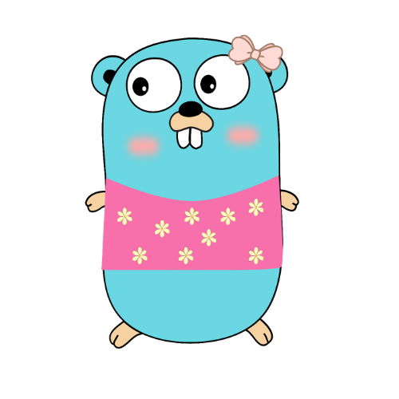

### What I’ve spent time on lately

- [keystroke-overlay-video-recorder](https://github.com/Makepad-fr/keystroke-overlay-video-recorder) : Records your screen with a subtle on-screen **keystroke** overlay (incl. Caps) for clear tutorials and demos.

- [partypin](https://github.com/Makepad-fr/partypin) : A lightweight event PWA that creates a **unique organizer ID** and lets guests **upload photos** under simple rules.

- [transformers](https://github.com/Makepad-fr/transformers) : Fast file conversion (**JPG→PNG**, **MP4→MP3**, etc.)

- [tada](https://github.com/Makepad-fr/tada) : A minimal terminal **to-do** that’s quick to add, list, and check off.

- [catwlk](https://github.com/Makepad-fr/catwlk) : Upload a photo and get **clothing type/occasion** with **confidence percentages** via an API.

- [A11y Linter](https://github.com/idilsaglam/a11y-linter) : In-browser checker for **WCAG 2.1 AA** issues in pasted HTML forms; instant and actionable notes.

- [alerteconso.com](https://github.com/Makepad-fr/alerteconso.com) : A clear dashboard and API for France’s **RappelConso** product recalls.

- [themailthing](http://www.themailthing.com) : Drop-in **web component** to send and collect email submissions; easy to embed anywhere.

---

[Website](https://idilsaglam.com) | [LinkedIn](https://www.linkedin.com/in/idilsaglam/) 
